# Mindnest

Mindnest is an LLM-powered code review tool designed to help developers improve code quality and maintainability. It's a self-hosted binary that runs locally on your machine, ensuring your code never leaves your environment.

```
███╗   ███╗██╗███╗   ██╗██████╗ ███╗   ██╗███████╗███████╗████████╗
████╗ ████║██║████╗  ██║██╔══██╗████╗  ██║██╔════╝██╔════╝╚══██╔══╝
██╔████╔██║██║██╔██╗ ██║██║  ██║██████╔╝█████╗  ███████╗   ██║   
██║╚██╔╝██║██║██║╚██╗██║██║  ██║██╔══╝  ╚════██║   ██║   
██║ ╚═╝ ██║██║██║ ╚████║██████╔╝██║ ╚████║███████╗███████║   ██║   
╚═╝     ╚═╝╚═╝╚═╝  ╚═══╝╚═════╝ ╚═╝  ╚═══╝╚══════╝╚══════╝   ╚═╝   
```


## Features

- Self-hosted binary with no cloud dependencies required
- AI-powered code reviews using local LLMs
- Context-aware code analysis with vector embeddings
- Automatic workspace management for different projects
- Git integration for reviewing staged changes, commits, or branch differences
- Github integration for submitting PR comments
- Intelligent code chunking and similarity search
- Vector database for storing and retrieving code embeddings
- Privacy-first: all processing happens locally on your machine
- Zero-configuration: embedded migrations and automatic setup

## Disclaimer

Mindnest is a toy project that I'm developing in my spare time. It's not production-ready and should not be used in any critical environments.

## Installation

### Prerequisites

- Go 1.24 or later
- SQLite
- Git
- [Ollama](https://github.com/ollama/ollama) default LLM for code reviews and embeddings using `nomic-embed-text`
- [Claude](https://console.anthropic.com/) API Key (optional, for LLM support)
- [Gemini](https://aistudio.google.com/apikey) API Key (optional, for LLM support)
- [Github](https://github.com) API Key (optional, for Github integration)

### Download Pre-built Binaries

The simplest way to install Mindnest is to download a pre-built binary from the [GitHub Releases](https://github.com/tildaslashalef/mindnest/releases) page.

1. Download the Linux binary from the [Releases page](https://github.com/tildaslashalef/mindnest/releases):
   - `mindnest-linux-amd64` for Linux

2. Make the binary executable:
   ```bash
   chmod +x mindnest-linux-amd64
   ```

3. Move the binary to a location in your PATH:
   ```bash
   # For Linux
   sudo mv mindnest-linux-amd64 /usr/local/bin/mindnest
   ```

> **Note:** Only Linux binaries are provided with full [sqlite-vec](https://github.com/asg017/sqlite-vec) vector database extension functionality. For macOS, please build from source on your local machine.

### Build from Source (Recommended for macOS)

```bash
# Clone the repository
git clone https://github.com/tildaslashalef/mindnest.git
cd mindnest

# Build the project
make build

# Install the binary to your GOPATH
make install
```

### Configuration

Mindnest now features a zero-configuration setup! On first run, it will:

1. Create a `.mindnest` directory in your home folder
2. Create and initialize the SQLite database with all necessary tables
3. Extract a sample `.env` configuration file to this directory

To customize your configuration:

1. Edit the `.env` file in your `~/.mindnest/` directory:
   ```bash
   # View the sample configuration
   cat ~/.mindnest/.env
   
   # Edit with your preferred editor
   vim ~/.mindnest/.env
   ```

2. Alternatively, you can use environment variables or a `.env` file in your current directory to override settings.

3. To specify a custom configuration file location:
   ```bash
   export ENV_FILE_PATH=/path/to/your/.env
   ```

All data including the database, embeddings, and configuration will be stored in your `~/.mindnest/` directory by default.

### Installing and Running Ollama

Mindnest uses Ollama for local LLM capabilities and vector embeddings. Follow these steps to set up Ollama:

#### 1. Install Ollama

**macOS or Linux:**
```bash
curl -fsSL https://ollama.com/install.sh | sh
```

**Windows:**
Download the installer from the [Ollama website](https://ollama.com/download).

#### 2. Start Ollama

```bash
ollama serve
```

This will start Ollama on `http://localhost:11434` (the default endpoint in Mindnest).

#### 3. Pull Required Models

Mindnest requires the following models:

```bash
# Pull the embedding model (required for code context retrieval)
ollama pull nomic-embed-text

# Pull the default LLM model (if using Ollama as LLM provider)
ollama pull gemma3
```

You can configure which models to use in your `.env` file.

## Usage

```bash
# Initialize Mindnest environment (first-time setup or after upgrading)
mindnest init
```

The `init` command sets up your Mindnest environment by:
- Creating the `~/.mindnest` directory to store all application data
- Setting up the SQLite database with all required tables
- Extracting a sample configuration file to `~/.mindnest/.env`
- Showing paths to important files (config, database, logs)

You should run this command when first installing Mindnest or after upgrading to a new version to ensure your database schema stays up-to-date.

```bash
# Review staged changes in the current Git repository (default)
cd /path/to/project && mindnest

# Review specific commit
cd /path/to/project && mindnest  --commit <commit-hash>

# Review differences between branches
cd /path/to/project && mindnest  --branch <branch-name>

# Set Github repository URL to submit PR comments
mindnest ws -g <github-repo-url>

# List current Workspace issues to review
mindnest ws 
```

## Development

### Project Architecture

```mermaid
%%{init: {
  'theme': 'dark',
  'themeVariables': {
    'fontFamily': 'monospace',
    'mainBkg': '#282828',
    'textColor': '#ebdbb2'
  }
}}%%

graph TB
    subgraph CLI["Command Layer"]
        CMD["mindnest CLI Commands"]
        CMD --> ReviewCmd["review"]
        CMD --> WorkspaceCmd["workspace"]
        CMD --> SyncCmd["sync"]
    end

    subgraph Services["Service Layer"]
        WS["Workspace Service"]
        Review["Review Service"]
        Git["Git Service"]
        LLM["LLM Service"]
        RAG["RAG Service"]
        Parser["Code Parser Service"]
        Sync["Sync Service"]
    end

    subgraph Repos["Repository Layer"]
        DB["SQLite + sqlite-vec"]
        FileRepo["File Repository"]
        ChunkRepo["Chunk Repository"]
        ReviewRepo["Review Repository"]
        SyncLogRepo["Sync Log Repository"]
    end

    subgraph External["External Services"]
        Ollama["Ollama LLM"]
        Claude["Claude LLM"]
        Gemini["Gemini LLM"]
        GitHub["GitHub"]
        Server["Mindnest Server (In Development)"]
    end

    subgraph UI["UI Layer"]
        TUI["Terminal UI"]
        Components["UI Components"]
        Navigation["Navigation"]
    end

    %% Command to UI connections
    ReviewCmd --> TUI
    WorkspaceCmd --> TUI
    SyncCmd --> TUI

    %% Service interconnections
    Review --> Git
    Review --> LLM
    Review --> RAG
    Review --> Parser
    RAG --> ChunkRepo
    WS --> FileRepo
    Sync --> WS
    Sync --> Review

    %% Repository to Database connections
    FileRepo --> DB
    ChunkRepo --> DB
    ReviewRepo --> DB
    SyncLogRepo --> DB

    %% External service connections
    LLM --> Ollama
    LLM --> Claude
    LLM --> Gemini
    Sync --> Server
    Git --> GitHub

    %% UI to Service connections
    TUI --> Review
    TUI --> WS
    TUI --> Sync
    Components --> Navigation

    %% Gruvbox-inspired styling
    classDef primary fill:#458588,stroke:#83a598,stroke-width:2px,color:#fbf1c7;
    classDef secondary fill:#689d6a,stroke:#8ec07c,stroke-width:2px,color:#fbf1c7;
    classDef external fill:#d65d0e,stroke:#fe8019,stroke-width:2px,color:#fbf1c7;
    classDef ui fill:#b16286,stroke:#d3869b,stroke-width:2px,color:#fbf1c7;
    classDef indev fill:#b57614,stroke:#fabd2f,stroke-width:2px,color:#fbf1c7;
    classDef default fill:#282828,stroke:#928374,color:#ebdbb2;

    class CLI,CMD,ReviewCmd,WorkspaceCmd,SyncCmd primary;
    class Services,WS,Review,Git,LLM,RAG,Parser,Sync secondary;
    class External,Ollama,Claude,Gemini,GitHub external;
    class Server indev;
    class UI,TUI,Components,Navigation ui;

    %% Update subgraph styles
    style CLI fill:#1d2021,stroke:#928374;
    style Services fill:#1d2021,stroke:#928374;
    style Repos fill:#1d2021,stroke:#928374;
    style External fill:#1d2021,stroke:#928374;
    style UI fill:#1d2021,stroke:#928374;
```



## Future Development: Centralized Collaboration

A key feature under development is the centralized Mindnest Web Server that will be available as an **optional opt-in feature**, while maintaining the core self-hosted experience. This server will enable teams to:

- Sync and share code reviews across team members
- Collaborate on code improvements with shared comments and annotations
- Track review history and progress across projects
- Provide team-wide insights and metrics on code quality

The Mindnest Web Server will act as a central hub for development teams to coordinate their code review processes, making collaborative code improvement more efficient while leveraging the power of LLM-assisted analysis. Users can continue using Mindnest as a fully local tool or choose to connect to the centralized server when team collaboration is needed.

## License

MIT License

## Author

Ahmed ElSebaei (@tildaslashalef)

## Contributing

Please refer to the [CONTRIBUTING.md](CONTRIBUTING.md) file for more information on how to contribute to Mindnest.